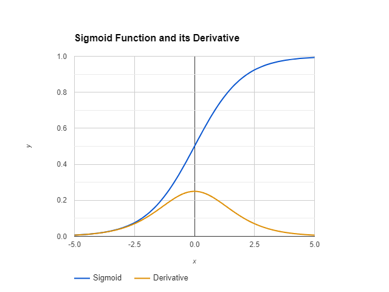

#### Vanishing Gradient Problem

In the process of backpropagation, the gradient that flows backward in the network becomes very small or zero. This makes it difficult for the newtork to learn from errors that occurred many layers earlier hindering its ability to ajust the weights effectively in a deeper parts of the network.

#### Activation functions

Activation functions are the non-linear functions added to the linear regression model so the model can capture more complex features.

- Sigmoid: $ f(x) = \frac{1}_{1 + e^(-x)}$   
The value range from 0 to 1. It has some problem with vanishing gradient on the extreme and is also computatinoally expensive since it uses exponential function.  
The derivative of sigmoid function :
$$ \sigma'(x) = \frac{e^{-x}} {(1 + e^{-x})^2} $$
The value of derivative is +ve between 0 and 0.5, -ve between 0.5 and positive infinity. It reaches maximum value of 0.25 at x = 0. This characteristic plays a role in the vanishing gradient problem when using the sigmoid function in deep neural networks. As the input values move away from zero, the derivative approaches zero, causing gradients to shrink during backpropagation.

- Tanh
- ReLU: 

#### RNN
RNN has shorter window to reference from. Can't access generated 

Attention Is All You Need [cite]:  

#### Transformers

#### BERT
Encoder
    - Positional information
    - Multihead Attention
        - Self-Attention (focus word)
        - scale
        - softmax
        - Matrix multiplication positional importance and word embedding
    - Concat 
    - Linear layer

Decoder
    - 